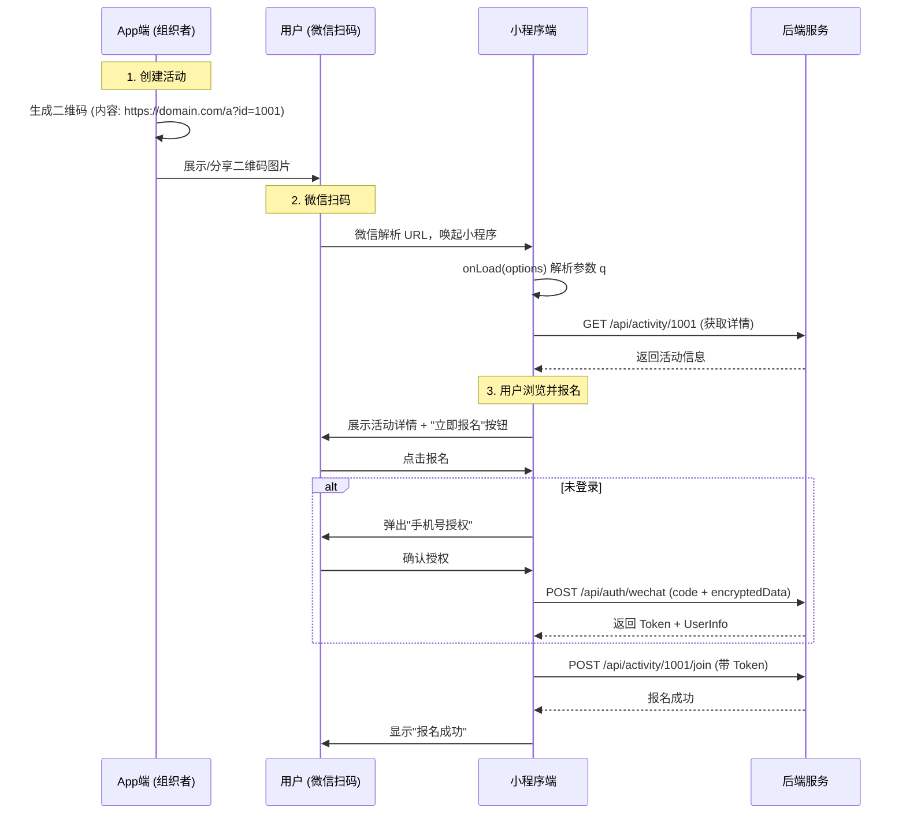

# 微信小程序扫码加入活动技术方案

## 1. 方案概述

本方案旨在实现“App 分享活动二维码 -> 用户微信扫码 -> 唤起小程序 -> 授权报名”的完整闭环。

### 核心选型

| 模块 | 选型建议 | 理由 |
| :--- | :--- | :--- |
| **二维码类型** | **普通链接二维码** (Common Link) | 1. 兼容性好：微信扫进小程序，浏览器扫进 H5<br>2. App 端生成简单，无需后端绘图<br>3. 微信后台配置灵活 |
| **账号体系** | **手机号 One-ID** | 唯一能打通 App (手机号注册) 与小程序 (微信授权手机号) 的标识 |
| **前端框架** | **uni-app x** | 复用现有 `frontend` 代码，通过条件编译处理差异 |
| **后端接口** | **RESTful API** | 需新增 `/api/activity/join` (报名) 和 `/api/auth/wechat` (微信登录) |

---

## 2. 详细实现流程

### 2.1 业务流程图



### 2.2 关键技术点

#### A. 普通链接二维码配置
1.  登录 [微信公众平台](https://mp.weixin.qq.com)。
2.  进入 **开发 -> 开发管理 -> 开发设置 -> 扫普通链接二维码打开小程序**。
3.  添加规则：
    *   **二维码规则**：`https://你的域名/activity/`
    *   **前缀占用规则**：选择“不占用”
    *   **校验文件**：下载文件放到域名根目录
    *   **小程序功能页面**：`pages/activity/detail/detail` (或其他落地页)
    *   **测试范围**：开发版/体验版/线上版

#### B. 小程序端参数解析
在 `frontend/pages/activity/detail/detail.uvue` (或专用落地页) 中处理：

```typescript
onLoad(options: OnLoadOptions) {
  // 场景1: 扫普通链接二维码进入
  if (options['q']) {
    const q = decodeURIComponent(options['q'] as string);
    // 提取 id，假设链接是 https://domain.com/activity/123
    const id = q.split('/').pop(); 
    this.loadActivity(id);
  }
  // 场景2: 小程序内部跳转 / App 分享卡片
  else if (options['id']) {
    this.loadActivity(options['id']);
  }
}
```

#### C. 手机号授权登录
利用微信 `button open-type="getPhoneNumber"` 能力：

```html
<!-- 伪代码 -->
<button open-type="getPhoneNumber" @getphonenumber="onGetPhoneNumber">
  微信一键登录
</button>
```

---

## 3. 测试验证策略

### 3.1 开发者工具模拟 (无需真机)

1.  打开微信开发者工具。
2.  点击顶部 **普通编译** 下拉框 -> **添加编译模式**。
3.  **模式名称**：模拟扫码 1001。
4.  **启动页面**：`pages/activity/detail/detail`。
5.  **启动参数**：`q=https%3A%2F%2Fdomain.com%2Factivity%2F1001` (注意 URL Encode)。
6.  **验证**：查看控制台是否正确解析出 `id=1001` 并发起请求。

### 3.2 真机体验版测试

1.  确保微信后台已配置“测试链接”（如 `https://domain.com/activity/test`）。
2.  上传小程序代码为“体验版”。
3.  使用草料二维码生成器，将 `https://domain.com/activity/test` 生成二维码图片。
4.  使用微信扫描该二维码。
5.  **验证**：
    *   是否直接拉起小程序？
    *   是否进入详情页？
    *   页面数据是否加载成功？

### 3.3 账号互通测试 (关键)

**测试用例 TC-SYNC-001**：
1.  **前提**：App 端已注册用户 A (手机号 138xxxx)。
2.  **操作**：
    *   用户 A 使用微信 (绑定同手机号) 扫码进入小程序。
    *   点击报名，授权手机号。
3.  **预期**：
    *   小程序端提示“报名成功”。
    *   App 端刷新“我的报名”，出现该活动。
    *   App 端查看“个人中心”，头像/昵称应保持一致 (或合并)。

**测试用例 TC-SYNC-002**：
1.  **前提**：新用户 B (手机号 139xxxx) 从未使用过 App。
2.  **操作**：
    *   微信扫码 -> 授权手机号报名。
    *   下载 App -> 使用 139xxxx + 验证码登录。
3.  **预期**：
    *   App 登录后，在“我的报名”中能看到刚才在小程序报名的活动。
