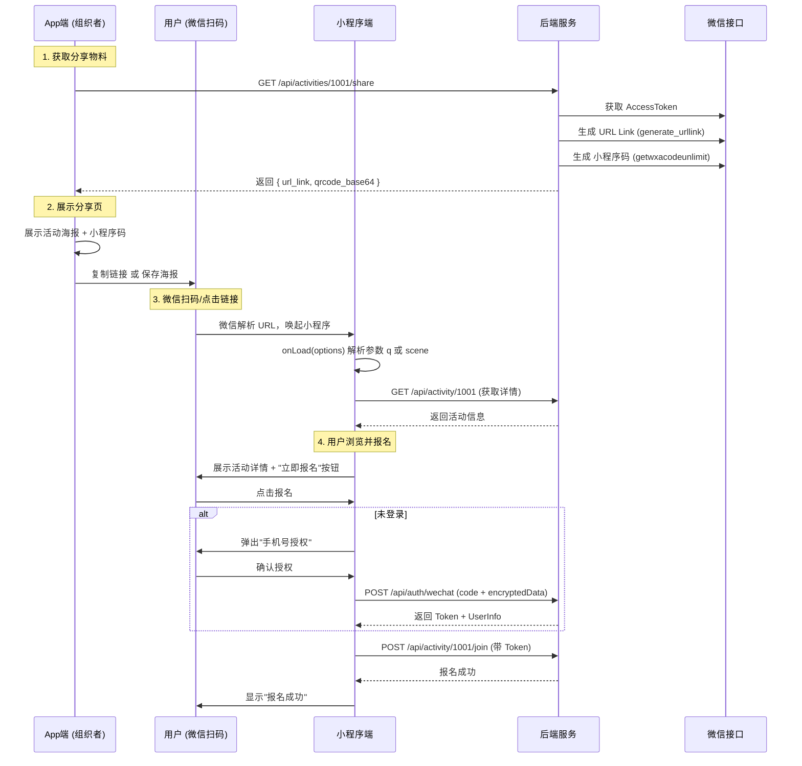

# 微信小程序扫码加入活动技术方案

## 1. 方案概述

本方案旨在实现“App 分享活动二维码 -> 用户微信扫码 -> 唤起小程序 -> 授权报名”的完整闭环。

### 核心选型

| 模块 | 选型建议 | 理由 |
| :--- | :--- | :--- |
| **二维码类型** | **普通链接二维码** (Common Link) & **小程序码** (Mini Program Code) | 1. 普通链接二维码兼容性好，支持非微信环境唤起<br>2. 小程序码辨识度高，微信内体验最佳<br>3. URL Link 适合短信/外部浏览器传播 |
| **账号体系** | **手机号 One-ID** | 唯一能打通 App (手机号注册) 与小程序 (微信授权手机号) 的标识 |
| **前端框架** | **uni-app x** | 复用现有 `frontend` 代码，通过条件编译处理差异 |
| **后端接口** | **RESTful API** | 新增 `/api/activities/<id>/share` 获取分享物料 |

---

## 2. 详细实现流程

### 2.1 业务流程图



### 2.2 关键技术点

#### A. 后端接口实现 (Python Flask)

后端需提供接口生成分享所需的物料。

**接口定义**: `GET /api/activities/<id>/share`

**响应示例**:
```json
{
  "url_link": "https://wxaurl.cn/AbCdEf",
  "qrcode_data": "data:image/jpeg;base64,....",
  "activity_info": { ... }
}
```

**依赖配置**:
在 `config.py` 中增加：
```python
WECHAT_APPID = os.environ.get('WECHAT_APPID')
WECHAT_SECRET = os.environ.get('WECHAT_SECRET')
```

#### B. 小程序端参数解析

在 `frontend/pages/activity/detail/detail.uvue` 中统一处理入口参数：

```typescript
onLoad(options: OnLoadOptions) {
  // 场景1: 扫普通链接二维码进入 (q参数)
  if (options['q']) {
    const q = decodeURIComponent(options['q'] as string);
    // 提取 id，假设链接是 https://domain.com/activity/123
    const id = q.split('/').pop(); 
    this.loadActivity(id);
  }
  // 场景2: 扫小程序码进入 (scene参数)
  else if (options['scene']) {
    // scene 内容为 id=123
    const scene = decodeURIComponent(options['scene'] as string);
    const id = scene.split('=')[1];
    this.loadActivity(id);
  }
  // 场景3: 小程序内部跳转 / App 分享卡片
  else if (options['id']) {
    this.loadActivity(options['id']);
  }
}
```

#### C. App 端分享页实现

在 `frontend/pages/activity/share/share.uvue` 中：
1. 调用后端接口获取 `url_link` 和 `qrcode_data`。
2. **复制链接**：使用 `uni.setClipboardData` 复制 `url_link`。
3. **保存海报**：将 `qrcode_data` (Base64) 绘制到 Canvas 或直接保存图片。

---

## 3. 测试验证策略

### 3.1 开发者工具模拟 (无需真机)

1.  打开微信开发者工具。
2.  点击顶部 **普通编译** 下拉框 -> **添加编译模式**。
3.  **模式名称**：模拟扫码 1001。
4.  **启动页面**：`pages/activity/detail/detail`。
5.  **启动参数**：
    *   测试普通链接：`q=https%3A%2F%2Fdomain.com%2Factivity%2F1001`
    *   测试小程序码：`scene=id%3D1001`
6.  **验证**：查看控制台是否正确解析出 `id=1001` 并发起请求。

### 3.2 真机体验版测试

1.  确保微信后台已配置“测试链接”或已发布小程序码。
2.  使用 App 生成的分享海报。
3.  使用微信扫描该二维码。
4.  **验证**：
    *   是否直接拉起小程序？
    *   是否进入详情页？
